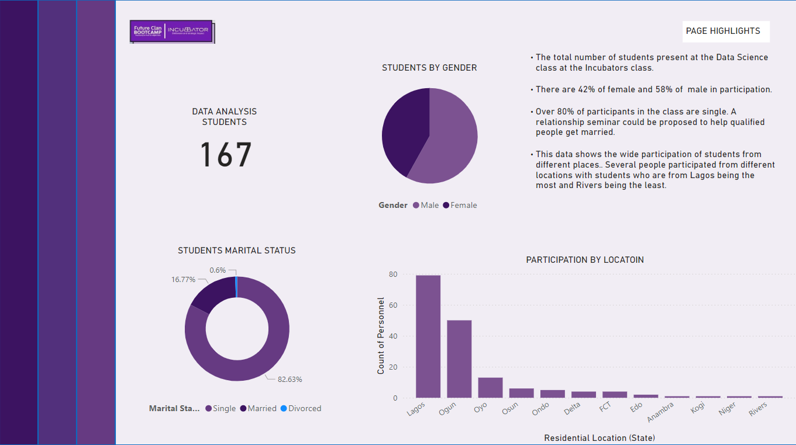
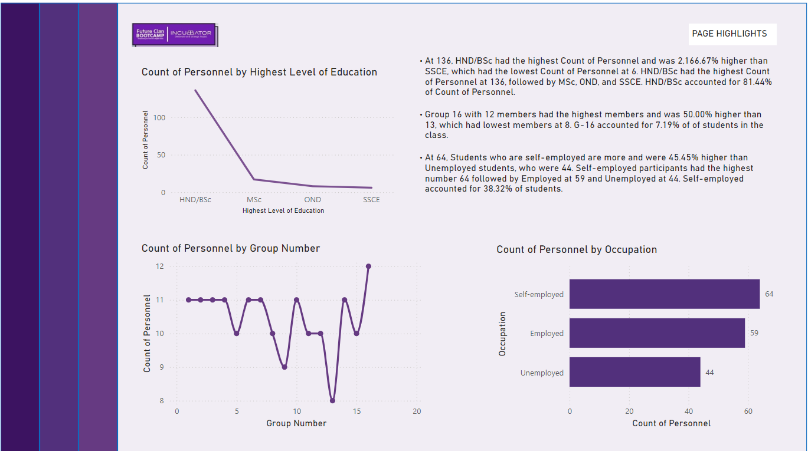

# INCUBATOR-NG-DATA-ANALYSIS-PARTICIPANTS-RECORD
This repository shares the data of students in the Data Analysis class.
***
1.) The data below talks about individuals who took a data analysis class, their gender, marital status and where they travelled from.

***
2.) This page further talks about their educational level, what group there were during the ttaining and employment status.

